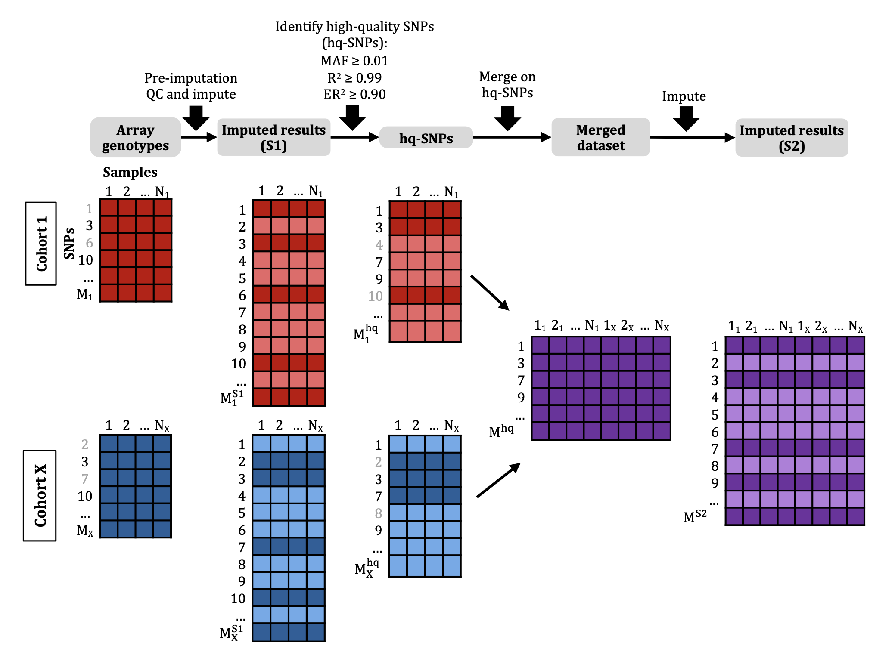

# TSIM: Two-Stage Imputation Method

**NOTE** (24 April 2024): The TOPMed Imputation Server v1.6.6 (Minimac v4-1.0.2 for imputation, Eagle v2.4 for phasing, r2 for reference panel) was used for testing TSIM and generating all results in the paper (see below). Since completing our analyses, the TOPMed Imputation Server has been updated to v1.8.0 (Minimac _v4.1.6_ for imputation, Eagle v2.4 for phasing, _r3_ for reference panel). We've found that the r2 filter for high-quality SNPs needs to be recalibrated for this updated reference panel and are currently working on that analysis.




## Installation
### Requirements
- python (3.9+)
    - cyvcf2
    - native libraries
        - sys
        - logging
        - datetime
        - argparse
        - gzip
- bcftools
- tabix

### Create conda virtual environment
```
conda env create -f environment.yml
conda activate tsim
```

##### Troubleshooting
If you get an error building wheel for cyvcf2, you can install the package manually with pip after activating the conda environment.
```
conda activate tsim
pip install cyvcf2
```

## Usage
tsim has 4 subcommands.
You can check the options with the -h flag of tsim.py
```
tsim.py -h
tsim.py rsq -h #recalculates Rsq based on selected samples
tsim.py qc -h #apply Rsq, ER2, MAF, and HWE filters to imputed variants
tsim.py overlap -h #find intersection of 2 variant lists
tsim.py merge -h #merge 2 VCFs based on variant list
```

**NOTE**: tsim was developed using output from the TOPMed Imputation Server v1.6.6 (Minimac4 for imputation, Eagle v2.4 for phasing, r2 for reference panel). We are aware that there were some recent changes in output format and are working on updating these scripts accordingly.


### Example 
Before running tsim.py, QC and impute your cohorts separately.

#### 1. (optional) Recalculate Rsq based on a subset of samples
Rsq (or R2) does not generally need to be recalculated. However, it is  a sample-based calculation. So, if you are working with a subset of samples included in the imputation results, recalculating rsq will provide more accurate measurements for determining high-quality SNPs.
- Input file (`-v`): imputed VCF
- Output file (`-o`): TSV file containing variant ID, alternative allele frequency (AAF), recalculated rsq (RSQ), original rsq (RSQ_TOPMED), and empirical rsq (ER2)

```
python tsim.py rsq -v a.vcf.gz -o a.recalc_rsq.tsv -s a.samples.txt
python tsim.py rsq -v b.vcf.gz -o b.recalc_rsq.tsv -s b.samples.txt
```

#### 2. QC imputed variants
- Input files (`-m`, `-r`): TSVs (can be gzipped) containing variant ID, allele frequency and rsq
  - Optional input file (`--hwe`): `*.hwe` from PLINK's `--hardy` option
  - The files containing allele frequencies (`-m`) and rsqs (`-r`) can be different. If they are the same, specify the same file for both `-m` and `-r`. Both flags are required.
- Output file (`-o`): text file containing variant IDs passing QC
- Specify chromosome using `-c` or `--chrom`
  
```
Recommended HWE command:
plink --vcf <vcf> --allow-no-sex --hardy --mpheno 4 --out <output> --pheno <fam_file> --update-sex <fam_file> 3
```

Default options: 
- QC filters
    - Rsq filter (`-rf`): >=0.99
    - MAF filter (`-mf`): >=0.01
    - ER2 filter (`-ef`): >=0.90
    - HWE filter (`-hf`): >=1e-6
- column numbers (based on output of `rsq` command)
    - variant ID (`-mvc`, `-rvc`): 1
    - Rsq (`-rc`): 3
    - MAF (`-mc`): 2
    - ER2 (`-ec`): 5

If working with a control-only cohort and you want to filter HWE, use flag `--nocases`.

```
python tsim.py qc -r a.recalc_rsq.tsv -m a.recalc_rsq.tsv -o a.variant_qc.txt --chrom 22 --hwe a.hardy.hwe
python tsim.py qc -r b.recalc_rsq.tsv -m b.recalc_rsq.tsv -o b.variant_qc.txt -c 22 --hwe b.hardy.hwe
```

#### 3. Find overlapping high-quality variants 
This command assumes that variants have consistent naming scheme across all cohorts.
- Input file (`-l`): text file containing list of file paths to high-quality SNP lists (i.e., output of `qc` command)
- Output file (`-o`): text file containing list of variants that are shared between all high-quality SNP lists
- Specify chromosome using `-c` or `--chrom`

```
### to create input file
ls *.variant_qc.txt > l.filelist.txt
###
python tsim.py overlap -l l.filelist.txt -o l.overlap.txt -c 22
```

#### 4. Merge VCFs
- Input file (`-l`): CSV file containing paths to VCFs to merge, SNP lists to merge on, and samples to include for each file (column 1 = VCF files, column 2 = SNP lists, 3 = sample lists). Sample lists can include all samples to be merged, it does not have to be cohort-specific.
- Output file (`-o`): merged VCFs
- Specify chromosome using `-c` or `--chrom`
- For high-quality SNPs, use flag `--snpsonly`

```
### to create input file
echo "a.vcf.gz,l.overlap.txt,a.samples.txt" > l.mergelist.txt
echo "b.vcf.gz,l.overlap.txt,b.samples.txt" >> l.mergelist.txt
###
python tsim.py merge -l l.mergelist.txt -o merged.vcf.gz -c 22 --snpsonly
```

5. Impute the merged VCFs.

The `rsq` and `qc` functions may also be used after the second stage of imputation. 


## Please cite paper below
Anya Greenberg, Kaylia Reynolds, Michelle T McNulty,  Matthew G. Sampson,  Hyun Min Kang,  Dongwon Lee. "Accurate cross-platform GWAS analysis via two-stage imputation." https://www.medrxiv.org/content/10.1101/2024.04.19.24306081v1
